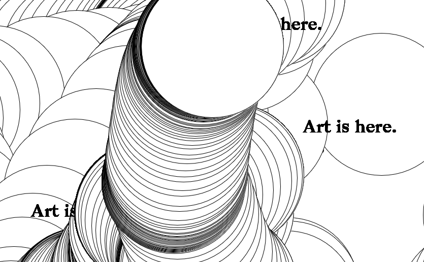
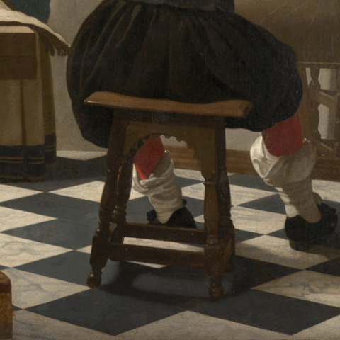

Travaux pour le [cours IFT6251 art algorithmique avec Benoît Beaudry](https://github.com/rethread-studio/algorithmic-art-course)

LenaMK Hiver 2024

[toc]

## Premier essai: [Where is art?](./where-is-art/)

## Genuary: [Vermeer's tiles](./vermeer/)

